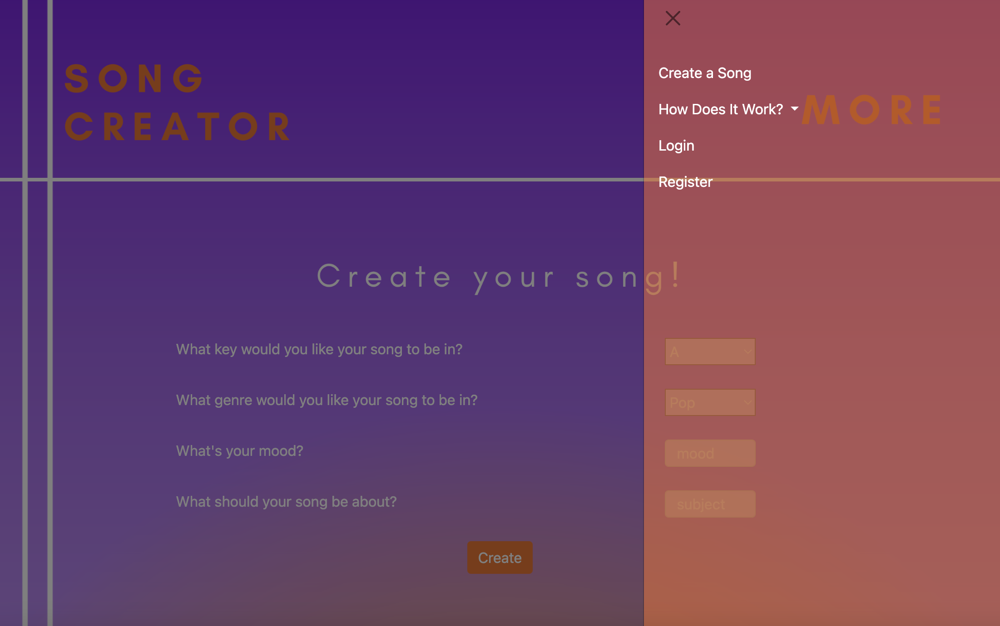
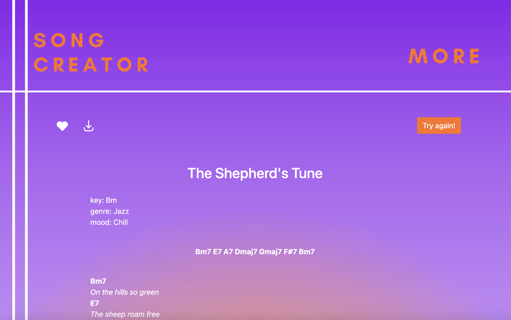
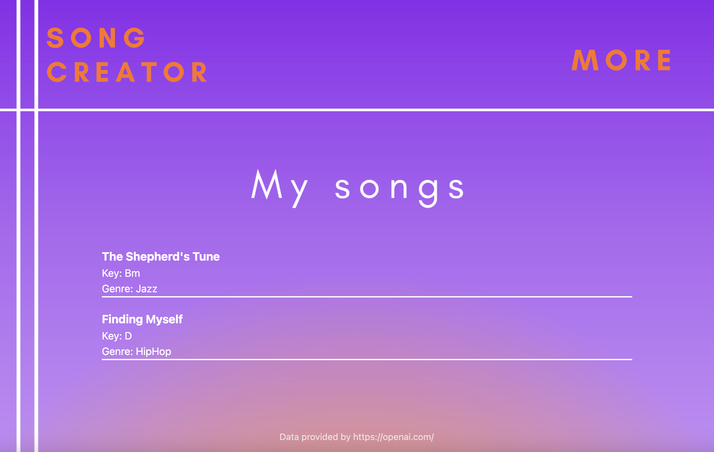

# Flask Song Creator

Made by Elise van Iterson, 2023

## Introduction

This is a Flask project for creating and saving songs. The application works with the openai ChatGPT API.
The app generates chords and lyrics based on the users requested key, genre, mood and subject. The website
can be used as inspiration for songwriters and musicians.

## Installation

1. Clone the repository: `git clone https://github.com/minprog-platforms/project-11907223`
2. Navigate to the project directory: `cd project-11907223`
3. Create a virtual environment: `python3 -m venv venv`
4. Activate the virtual environment:
   - For Mac/Linux: `source venv/bin/activate`
   - For Windows: `venv\Scripts\activate.bat`
5. Install the required dependencies: `pip install -r requirements.txt`

## Configuration

1. Rename the `.env.example` file to `.env`.
2. Update the configuration values in the `.env` file according to your environment.

## Usage

2. Start the Flask development server: `flask run`
3. Access the application in your browser at `http://localhost:5000`

## Features

- Create a new song by filling out the song details and subject.
- Download songs as PDF files.
- View a list of all saved songs in My Songs library.
- Delete and save song from my songs library.

## Folder Structure

- `project-11907223/`: Contains the main Flask application files.
  - `static/`: Holds static assets such as CSS, JavaScript and image files.
    - `images/`: Holds image files.
    - `javascript/`: Holds javascript files.
    - `styles.css`: Styleguide for all html files.
    - `spinner.css`: Style guide for spinner.
  - `song_files/`: Generated PDF for user to download.
  - `test/`: Output that can be used if API is not (yet) working.
  - `templates/`: Contains HTML templates for rendering the views.
  - `app.py`: Defines the application routes and all the back-end code.
  - `helpers.py`: Functions to support the app.py file.
  - `models.py`: Defines the database models for songs and users.
  - `create.py`: Configuration settings for the application.
  - `requirements.txt`: Lists the required Python packages and their versions.
  - `.env.example`: Example environment variable configuration file.
    (API key and database are also set in app.py, choose preferred method).

## Credits

- The API is copyright by openai 2023 [https://openai.com/blog/openai-api]
- The html/css navigation bar is copyright by bootstrap 2023 [https://getbootstrap.com/]
- The bar-loader is copyright by Josetxu on Codepen 2023 [https://codepen.io/josetxu/pen/LYrNQPd].

## Screenshots

## Contributing

Contributions are welcome! If you find any issues or have suggestions for improvements, please open an issue or submit a pull request.
